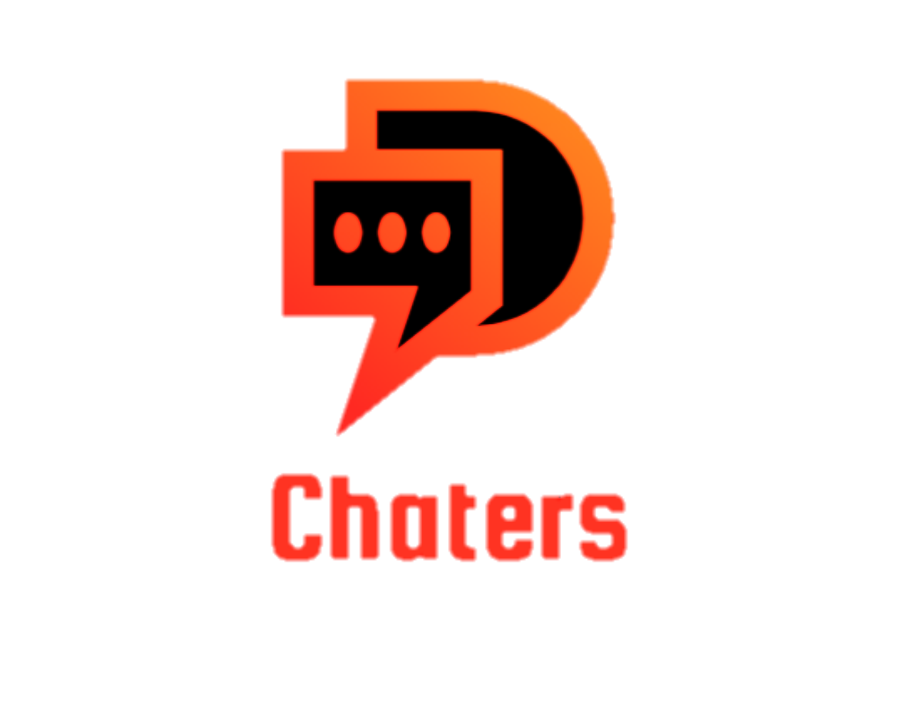

<!--
*** Thanks for checking out this README Template. If you have a suggestion that would
*** make this better, please fork the repo and create a pull request or simply open
*** an issue with the tag "enhancement".
*** Thanks again! Now go create something AMAZING! :D
-->
<p align="center">
  <h3 align="center">Chaters App</h1>
  <p align="center">
    
  </p>

  <p align="center">
    <br />
    <a href="https://github.com/FendiAnwarRifai/chaters-Frontend"><strong>Explore the docs »</strong></a>
    <br />
    <br />
    <a href="https://chaters.netlify.app">View Demo</a>
    ·
    <a href="https://github.com/FendiAnwarRifai/chaters-Frontend/issues">Report Bug</a>
    ·
    <a href="https://github.com/FendiAnwarRifai/chaters-Frontend/issues">Request Feature</a>
  </p>
</p>

<!-- TABLE OF CONTENTS -->
## Table of Contents

* [About the Project](#about-the-project)
  * [Built With](#built-with)
* [Getting Started](#getting-started)
  * [Prerequisites](#prerequisites)
  * [Installation](#installation)
* [Screenshots](#screenshots)
* [Related Project](#related-project)
* [Contact](#contact)


<!-- ABOUT THE PROJECT -->
## About The Project

Chaters is a messaging application for smartphones. Chaters is a cross-platform messaging application that allows us to exchange messages without credit, because Chaters uses internet data packages. Chaters application uses internet connection 3G, 4G or WiFi for data communication. Users can also update their profile by going to the settings menu except "my current location" because the user's location will be updated automatically when the user logs in. Other more important information is that users can get unread message notifications, online / offline status and contact info.

### Built With

* [Vue v2](https://vuejs.org/v2)
* [Vue Bootstrap](https://bootstrap-vue.org/)
* [Bootstrap V5](https://getbootstrap.com/docs/5.0/getting-started/introduction/)
* [Socket.io-client](https://socket.io/docs/v3/client-api/)


<!-- GETTING STARTED -->
## Getting Started

### Prerequisites

Before going to the installation stage there are some software that must be installed first.

* [NodeJs](https://nodejs.org/en/download/)

### Installation

If you want to run this project locally, I recommend you to configure the [Back-End](https://github.com/FendiAnwarRifai/chaters-API) first before configuring this repo front-end.
1. Clone the repo
```sh
git clone https://github.com/FendiAnwarRifai/chaters-Frontend.git
```
2. Install NPM packages
```sh
npm install
```
3. Add .env file at root folder project, and add following
```sh
VUE_APP_BASE_URL = [Backend API]
```
4. Run the project
```
  npm run serve
```


<!-- ROADMAP -->
## Screenshots

<p align='center'>
  <span>
      <image width="200" src='./screenshots/login.PNG' />
      <image width="200" src='./screenshots/register.PNG' />
      <image width="200" src='./screenshots/my-profile.PNG' />
      <image width="200" src='./screenshots/chat-friend.PNG' />
      <image width="200" src='./screenshots/info-friend.PNG' />
     

<!-- CONTRIBUTING -->
## Contributing

Contributions are what make the open source community such an amazing place to be learn, inspire, and create. Any contributions you make are **greatly appreciated**.

1. Fork the Project
2. Create your Feature Branch (`git checkout -b feature/AmazingFeature`)
3. Commit your Changes (`git commit -m 'Add some AmazingFeature'`)
4. Push to the Branch (`git push origin feature/AmazingFeature`)
5. Open a Pull Request


## Related Project
- [Chaters API](https://github.com/FendiAnwarRifai/chaters-API)


<!-- CONTACT -->
## Contact

- Email - fendianwar36@gmail.com
- LinkedIn - [Fendi Anwar Rifa'i](https://www.linkedin.com/in/fendi-anwar-rifai/)
